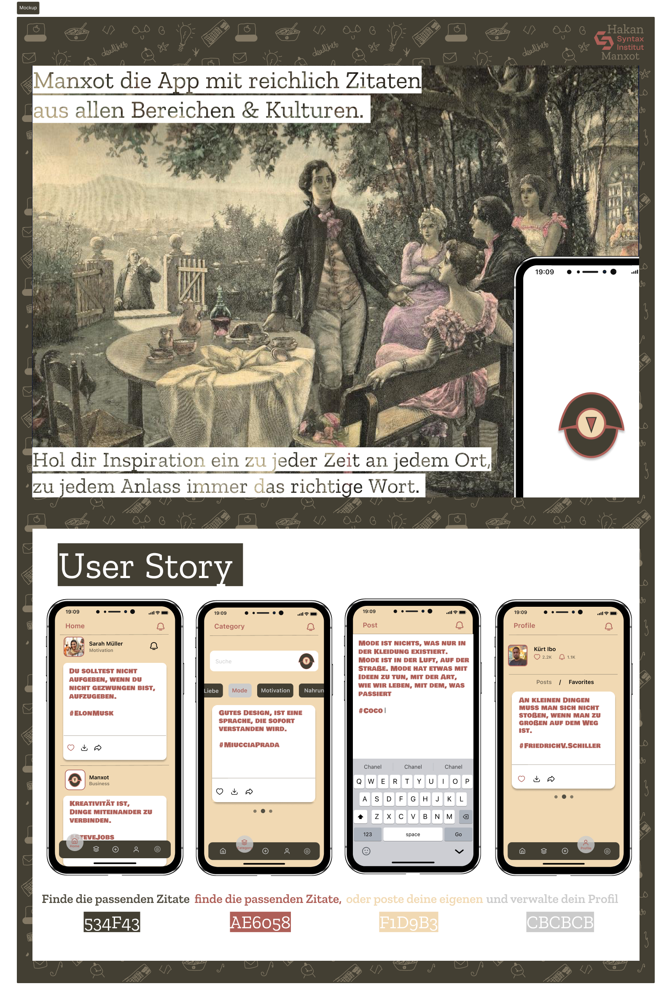

#

soon.

#

**Hallo! Mein Name ist Hakan Eren, ich bin ein Junior Mobile Developer mit Leidenschaft für sauberen Code und schönes Design. Ich stehe am Anfang meiner Reise, in der Mobilen App-Entwicklung und arbeite ständig daran, mich in diesem Bereich weiterzuentwickeln. Das Weiterbildungs-Programm am Snytax Institut habe ich erfolgreich abgeschlossen und bemühe mich weiterhin, meine Kenntnisse und Fähigkeiten auszubauen.**

#

- MacOS/ Windows
- Xcode/ SwiftUI/ Vapor/ Swift  
- Android Studio/ XML- UI/ Jetpack Compose/ Kotlin 
- Figma
- Material UI 
- Adobe
- Canva
- Slack
- Discord
- GitHub 
- Microsoft 365

#

 

#

hknrn40@gmail.com

